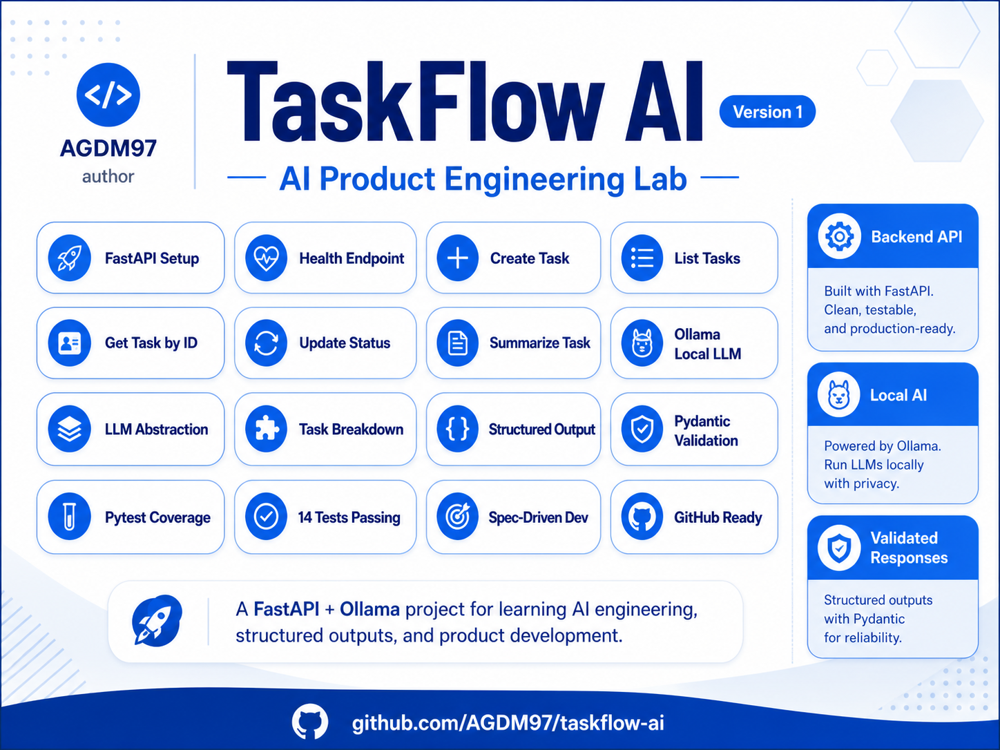

# TaskFlow AI



**TaskFlow AI** is an AI Product Engineering Lab built with **Python**, **FastAPI**, **Ollama**, **Pydantic**, and **pytest**.

The purpose of this project is to practice modern backend development and AI engineering using an incremental, hands-on, and Spec-Driven Development approach.

---

## Current Status

The project currently includes:

- FastAPI application setup
- Health check endpoint
- Task creation
- Task listing
- Get task by ID
- Update task status
- Task summarization with a local LLM
- Task breakdown into structured subtasks
- LLM provider abstraction
- Pydantic schema validation
- Controlled handling for invalid LLM outputs
- Automated tests with pytest

Current test result:

```bash
14 passed
```

---

## Tech Stack

| Area | Technology |
|---|---|
| Language | Python 3.12 |
| API Framework | FastAPI |
| Package Manager | uv |
| Validation | Pydantic |
| Local LLM Runtime | Ollama |
| Local Model | gemma3:1b |
| HTTP Client | httpx |
| Testing | pytest |
| Version Control | Git + GitHub |

---

## Features

### Health Check

```http
GET /health
```

Returns the API health status.

Example response:

```json
{
  "status": "ok"
}
```

---

### Create Task

```http
POST /tasks
```

Creates a new task.

Example request:

```json
{
  "title": "Study LLM integration",
  "description": "Connect FastAPI to a local Ollama model",
  "priority": "HIGH"
}
```

Example response:

```json
{
  "id": "generated-task-id",
  "title": "Study LLM integration",
  "description": "Connect FastAPI to a local Ollama model",
  "status": "TODO",
  "priority": "HIGH"
}
```

Rules:

- `title` is required.
- `title` must have at least 3 characters.
- `description` is optional.
- `priority` is optional.
- Default priority is `MEDIUM`.
- Initial status is always `TODO`.

---

### List Tasks

```http
GET /tasks
```

Returns all tasks currently stored in memory.

Example response:

```json
[
  {
    "id": "generated-task-id",
    "title": "Study LLM integration",
    "description": "Connect FastAPI to a local Ollama model",
    "status": "TODO",
    "priority": "HIGH"
  }
]
```

---

### Get Task by ID

```http
GET /tasks/{task_id}
```

Returns a specific task by ID.

Example success response:

```json
{
  "id": "generated-task-id",
  "title": "Study LLM integration",
  "description": "Connect FastAPI to a local Ollama model",
  "status": "TODO",
  "priority": "HIGH"
}
```

If the task does not exist:

```json
{
  "detail": "Task not found"
}
```

---

### Update Task Status

```http
PATCH /tasks/{task_id}/status
```

Updates the status of an existing task.

Example request:

```json
{
  "status": "IN_PROGRESS"
}
```

Supported statuses:

```text
TODO
IN_PROGRESS
DONE
BLOCKED
```

Example response:

```json
{
  "id": "generated-task-id",
  "title": "Study LLM integration",
  "description": "Connect FastAPI to a local Ollama model",
  "status": "IN_PROGRESS",
  "priority": "HIGH"
}
```

---

### Summarize Task

```http
POST /tasks/{task_id}/summarize
```

Generates a concise task summary using a local LLM through Ollama.

Example response:

```json
{
  "task_id": "generated-task-id",
  "summary": "Connect a FastAPI application to a local Ollama model for LLM integration."
}
```

---

### Break Task into Subtasks

```http
POST /tasks/{task_id}/breakdown
```

Uses the local LLM to generate structured subtasks.

Example response:

```json
{
  "task_id": "generated-task-id",
  "subtasks": [
    {
      "title": "Define API contract",
      "description": "Create the endpoint contract for task breakdown.",
      "priority": "HIGH"
    },
    {
      "title": "Implement service",
      "description": "Create the service that calls the LLM client.",
      "priority": "HIGH"
    },
    {
      "title": "Add tests",
      "description": "Validate successful and error scenarios.",
      "priority": "MEDIUM"
    }
  ]
}
```

If the LLM returns invalid structured output:

```json
{
  "detail": "Invalid LLM output"
}
```

HTTP status:

```text
502 Bad Gateway
```

---

## AI Engineering Concepts Practiced

This project demonstrates important AI engineering patterns:

### 1. LLM Abstraction

The API route does not call Ollama directly.

Current flow:

```text
task_routes.py
  -> task_summary_service.py / task_breakdown_service.py
    -> llm_client.py
      -> ollama_client.py
        -> Local Ollama model
```

This design makes it easier to replace Ollama with another provider in the future.

Possible future providers:

- OpenAI
- Azure OpenAI
- Anthropic
- Gemini
- Other local models

---

### 2. Structured Output

The task breakdown feature expects the LLM to return structured JSON.

The application then:

```text
LLM raw output
  -> JSON parse
  -> Pydantic validation
  -> API response
```

This avoids trusting raw LLM output directly.

Key principle:

```text
Never trust raw LLM output directly.
```

---

### 3. Controlled Error Handling

If the LLM returns invalid structured output, the API returns a controlled error instead of crashing with an internal server error.

Example:

```json
{
  "detail": "Invalid LLM output"
}
```

---

### 4. Test Isolation with Mocks

Automated tests do not depend on Ollama being available.

LLM calls are mocked during tests using `monkeypatch`.

This makes tests:

- Faster
- More predictable
- Independent from local model availability
- Safer for CI/CD

---

## Project Structure

```text
taskflow-ai/
  app/
    api/
      task_routes.py
    core/
      settings.py
    models/
    schemas/
      task_schema.py
    services/
      llm_client.py
      ollama_client.py
      task_breakdown_service.py
      task_service.py
      task_summary_service.py
    main.py
  specs/
    break-task-into-subtasks.md
    create-task.md
    get-task-by-id.md
    summarize-task.md
    update-task-status.md
  tests/
    test_task_routes.py
  docs/
    assets/
      taskflow-ai-overview.png
    API.md
    ARCHITECTURE.md
  pyproject.toml
  uv.lock
  README.md
```

---

## Running Locally

### 1. Clone the repository

```bash
git clone https://github.com/AGDM97/taskflow-ai.git
cd taskflow-ai
```

### 2. Install dependencies

```bash
uv sync
```

### 3. Start Ollama

Check Ollama:

```bash
ollama --version
```

Pull the local model:

```bash
ollama pull gemma3:1b
```

Check installed models:

```bash
ollama list
```

### 4. Run the API

```bash
uv run uvicorn app.main:app --reload
```

Open Swagger UI:

```text
http://127.0.0.1:8000/docs
```

---

## Running Tests

```bash
uv run pytest
```

Expected result:

```text
14 passed
```

---

## Development Workflow

This project follows a Spec-Driven Development workflow:

```text
Spec -> Schema -> Service -> Route -> Test -> Commit
```

Each feature starts with a specification file inside the `specs/` folder.

Current specs:

- `create-task.md`
- `get-task-by-id.md`
- `update-task-status.md`
- `summarize-task.md`
- `break-task-into-subtasks.md`

---

## GitHub Repository Setup

Recommended repository description:

```text
AI Product Engineering Lab for building FastAPI-based task workflows with local LLMs, structured outputs, Pydantic validation, and automated tests.
```

Recommended topics:

```text
fastapi
python
ollama
llm
ai-engineering
pydantic
pytest
spec-driven-development
structured-output
local-llm
backend
ai-agents
uv
```

---

## Roadmap

Next improvements:

- Improve JSON extraction from local LLM responses
- Add standardized API error schema
- Add PostgreSQL persistence
- Add repositories
- Add task history
- Add RAG over project documents
- Add evals for LLM outputs
- Add GitHub Actions
- Add Docker support
- Add MCP server
- Add simple web UI with Next.js

---

## Repository

```text
https://github.com/AGDM97/taskflow-ai
```

---

## Author

Built by **AGDM97** as part of an AI Engineering learning journey.
